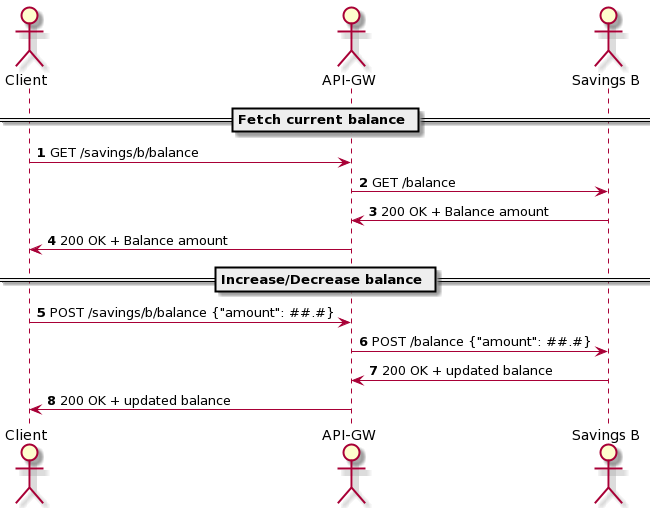

# Modules

* savings-a
* savings-b
* api-gateway
* buildSrc: contains templates for re-usability on gradle scripts.

# Execution

## Building and running the complete environment on docker

<details>
  <summary>click to toggle expand</summary>

Preparing the images:

```shell
./gradlew bootBuildImage
```

Starting the complete environment:

```shell
cd docker/complete-env
docker compose -p temp up
```

To read the access logs from api gateway:

```shell
docker exec -it temp-api-gateway-1 bash
cat /workspace/access_log.log
```

</details>

## Running the apps through gradle and the databases on docker

<details>
  <summary>click to toggle expand</summary>

Starting the databases:

```shell
cd docker/env-without-apps
docker compose -p temp up
```

Then you choose to

* start all the apps in one go (console logs become mixed):
    * `./gradlew b --parallel --max-workers=4 -x checkstyleMain -x checkstyleTest -x spotbugsMain -x spotbugsTest -x test bootRun -PjvmArgs="-Dreactor.netty.http.server.accessLogEnabled=true"`
* or start each separately:
    * `./gradlew savings-a::bootRun`
    * `./gradlew savings-b::bootRun`
    * `./gradlew api-gateway::bootRun -PjvmArgs="-Dreactor.netty.http.server.accessLogEnabled=true"`

The API Gateway **access logs** will be located on the root folder of the api-gateway module.

</details>

# Cleaning up

<details>
  <summary>click to toggle expand</summary>

```shell
# at the docker compose folder you used the up command
docker compose -p temp down --remove-orphans
```

</details>

# Utilities scripts

<details>
  <summary>click to toggle expand</summary>

At folder `scripts/`

* [api-get-balance.sh](scripts/api-get-balance.sh): send get balance request to the api gateway
    * args:
        * `a` or `b` depending on the module you want to reach
    * example:
        * `scripts/api-get-balance.sh b`
* [api-update-balance.sh](scripts/api-update-balance.sh): send update balance request to the api gateway
    * args:
        * `a` or `b` depending on the module you want to reach
        * amount you want to add or subtract
    * example:
        * `scripts/api-update-balance.sh a -12.32`
* [get-balance.sh](scripts/get-balance.sh): send get balance request to a specific savings server
    * args:
        * port: depending on the module you want to reach
    * example:
        * `scripts/get-balance.sh 8081`
* [update-balance.sh](scripts/update-balance.sh): send update balance request to a specific savings server
    * args:
        * `a` or `b` depending on the module you want to reach
        * amount you want to add or subtract
    * example:
        * `scripts/update-balance.sh 8081 -12.32`

</details>

# Extra questions

## How would you test the timeouts?

1. at integration testing
    1. Using `org.testcontainers:mockserver` and `org.mock-server:mockserver-client-java` to start a fake backend
       service and setup delays for the responses. Then customize the spring test context to use the fake server.
2. at any environment, even production
    1. If there is authentication and authorization, you can configure roles for using test features. Apply that role to
       the access that the team creates for testing. Call the api gateway with authentication and pass extra header
       params that specify a test scenario that you want to force on that environment for your request.
    2. Or you can also use the configuration management tool (Consul, etc.) to specify a scenario you want to force, but
       then you probably should also use a way to identify and filter your test request.

## How to scale the API Gateway?

* If you are not using a cloud environment
    * You are going to need a dns server returning IPs pointing to multiple HAProxies, these proxies will be the entry
      point for the requests incoming from public internet.
        * this provides client side fail-over
    * Those HAProxies will load balance to the entry-points associated to your api-gateway's set of instances on a
      service orchestrator
* If you are using cloud environment
    * You can configure your cloud environment's DNS service to point to your CDN/Edge which you'll point to your
      orchestrator's Load Balancers.

## How to monitor uptime, so you can sleep at night?

There is a wealth of observability tools to use. For uptime monitoring you can use a tool such as Prometheus and expose
metrics and heal-check endpoints on your services. Log analysis tools such as Splunk or ELK are able to monitor log
messages and generate alerts. Those are all capable of dashboard creation.

Distributed tracing tools, e.g. Zipkin, facilitates to pinpoint problems if your interconnected services count is bigger
than a few nodes.

Tools like New Relic or Dynatrace add a long list of observability characteristics that can be used to detect and alert
about problems, but are neither open-source nor free.

It would be wise to use service orchestrators (e.g. Kubernetes, Marathon) to take care of eventually failing instances.

# Next Steps / Improvements

1. All the unit and integration testing
2. Add authentication and authorization (e.g. spring boot security, spring cloud vault, Hashicorp's Vault)
3. Usage of configuration management (e.g. Consul)
4. Usage of distributed tracing (e.g. Zipkin)
5. Usage of orchestration framework (e.g. Kubernetes)
6. Monitoring (e.g. spring boot actuators, ELK, Prometheus)

# Considerations on implementing a transference feature

Let's assume the balance is located on different services using different databases. Let's ignore account holder
information. Using only relational database and nothing else.

1. inputs:
    * idempotency_code: a client-side ID for the request.
    * idempotency_module: the client module name. \[idempotency_code, idempotency_module\] pair is a unique key for the
      operation and if the transference module receives multiple requests with equal pair, it will silently drop the
      request.
    * timestamp
    * balance_service_source
    * balance_service_destination
    * amount: positive big decimal

Success scenario:

1. create an idempotency pair for the transference module debit request
2. save a row with instructions to undo a debit on the source account
3. send request to the balance service for the source account, telling to debit the amount.
4. create an idempotency pair for the transference module credit request
5. save a row with instructions to undo a credit on the destination account
6. send an async request to the balance service for the destination account, telling to credit the amount.
7. start a database transaction
    1. fetch both rows with pessimistic lock (select for update)
        1. if they are marked as 'created'
            1. update the rows, flagging to not perform the undo operation. (because the transfer was successful)
        2. else
            1. so, during the course of this process, other process is trying to or already did undo the operation.
    2. commit

Non-trivial error scenarios:

1. Timeout on sending debit request. You don't know if the operation was performed or not.
2. Send undo operation. **remember: if you send undo requests for an operation that was not processed by the balance
   service, nothing happens. And if you send multiple undo for an operation, no problem, it will be un-done once.**
3. update undo row as done
    1. if module fails in any of those steps no problem, there will be a scheduled job that will fetch rows of undo
       operations that were not yet flagged as 'performed' and from

Idempotency code is useful to prevent unintended duplicated operations. Undo operation allows for a client service
timely abort of a previous operation. Lease would expire if left un-confirmed after expiration.

# Exercise Definition

<details>
  <summary><b>Things from the exercise definition</b></summary>

# Requirements

## API Gateway

- run on port 8080
- respond in less than 5 seconds, else throw a timeout.
- log to file all incoming requests as info level

## Savings A

- run on port 8081
- return the current balance for account A
- increase/decrease the balance for account A
- persist the balance in a PostgreSQL database. Feel free to define your schema.

## Savings B

- run on port 8082
- return the current balance for account B
- increase/decrease the balance for account B

# Sequence Diagrams

## Savings A


## Savings B



</details>